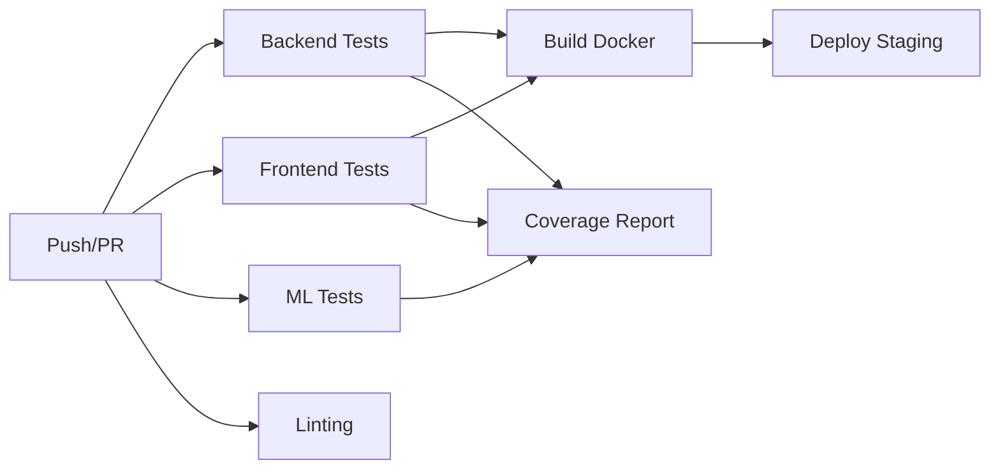

# Testing Guide - Real Estate OS

**PR#2: ops/ci-tests**

Complete guide to testing infrastructure, coverage requirements, and best practices.

## Table of Contents

1. [Overview](#overview)
2. [Backend Testing (Pytest)](#backend-testing-pytest)
3. [Frontend Testing (Vitest)](#frontend-testing-vitest)
4. [CI/CD Pipeline](#cicd-pipeline)
5. [Coverage Requirements](#coverage-requirements)
6. [Writing Tests](#writing-tests)
7. [Running Tests](#running-tests)
8. [Best Practices](#best-practices)
9. [Troubleshooting](#troubleshooting)

---

## Overview

Real Estate OS uses comprehensive test coverage across backend (Python/FastAPI), frontend (React/TypeScript), and ML models.

### Test Stack

| Layer | Framework | Coverage Target | Status |
|-------|-----------|-----------------|--------|
| **Backend** | Pytest + FastAPI TestClient | ≥60% | ✅ |
| **Frontend** | Vitest + React Testing Library | ≥40% | ✅ |
| **ML Models** | Pytest + NumPy testing | ≥50% | 🚧 |
| **E2E** | Cypress (future) | N/A | 📋 |

---

## Backend Testing (Pytest)

### Configuration

`pytest.ini`:
```ini
[pytest]
python_files = test_*.py *_test.py
python_classes = Test*
python_functions = test_*
testpaths = tests

addopts =
    -v
    --cov=api/app
    --cov=db
    --cov=ml
    --cov-fail-under=60
    --cov-report=html
    --cov-report=term-missing
```

### Test Structure

```
tests/
├── conftest.py              # Shared fixtures
├── test_auth.py             # Authentication tests
├── test_properties.py       # Property endpoint tests
├── test_outreach.py         # Outreach endpoint tests
├── fixtures/
│   └── tenant_context.py    # Multi-tenant fixtures
└── integration/
    └── test_workflows.py    # End-to-end workflows
```

### Key Fixtures

```python
# tests/conftest.py

@pytest.fixture
def client(db_session):
    """FastAPI test client with database override"""
    return TestClient(app)

@pytest.fixture
def auth_headers(auth_token):
    """Authorization headers with Bearer token"""
    return {"Authorization": f"Bearer {auth_token}"}

@pytest.fixture
def test_tenant(db_session):
    """Create test tenant"""
    tenant = DBTenant(name="Test Org", slug="test-org")
    db_session.add(tenant)
    db_session.commit()
    return tenant
```

### Running Backend Tests

```bash
# Run all tests
pytest

# Run specific test file
pytest tests/test_auth.py

# Run with coverage report
pytest --cov=api/app --cov-report=html

# Run specific test
pytest tests/test_auth.py::test_login_success -v

# Run tests with markers
pytest -m "unit"          # Only unit tests
pytest -m "not slow"      # Skip slow tests
pytest -m "auth"          # Only auth tests

# Parallel execution
pytest -n auto            # Uses all CPU cores
```

### Test Categories (Markers)

```python
@pytest.mark.unit           # Fast, no external dependencies
@pytest.mark.integration    # Requires database/API
@pytest.mark.slow           # Takes >1 second
@pytest.mark.auth           # Authentication tests
@pytest.mark.properties     # Property endpoint tests
@pytest.mark.outreach       # Outreach tests
@pytest.mark.tenant         # Multi-tenant isolation
```

---

## Frontend Testing (Vitest)

### Configuration

`web/vitest.config.ts`:
```typescript
export default defineConfig({
  test: {
    globals: true,
    environment: 'jsdom',
    setupFiles: ['./src/test/setup.ts'],
    coverage: {
      provider: 'v8',
      reporter: ['text', 'json', 'html'],
      lines: 40,
      functions: 40,
      branches: 40,
      statements: 40,
    },
  },
});
```

### Test Structure

```
web/src/
├── test/
│   ├── setup.ts             # Test environment setup
│   └── utils.tsx            # Testing utilities
├── components/
│   ├── CampaignsTab.test.tsx
│   ├── PropertyDrawer.test.tsx
│   └── DetailsTab.test.tsx
└── services/
    └── api.test.ts          # API client tests
```

### Test Utilities

```typescript
// web/src/test/utils.tsx

export function renderWithProviders(ui: ReactElement) {
  const queryClient = createTestQueryClient();

  return render(
    <QueryClientProvider client={queryClient}>
      {ui}
    </QueryClientProvider>
  );
}

export function setupUser() {
  return userEvent.setup();
}

export function mockApiResponse(data: any) {
  return Promise.resolve({ data });
}
```

### Running Frontend Tests

```bash
cd web

# Run all tests
npm test

# Run with UI (interactive)
npm run test:ui

# Run with coverage
npm run test:coverage

# Watch mode
npm test -- --watch

# Run specific file
npm test -- CampaignsTab.test.tsx

# Update snapshots
npm test -- -u
```

### Example Component Test

```typescript
// web/src/components/CampaignsTab.test.tsx

import { describe, it, expect, vi } from 'vitest';
import { screen, waitFor } from '@testing-library/react';
import { renderWithProviders, setupUser } from '../test/utils';
import { CampaignsTab } from './CampaignsTab';

describe('CampaignsTab', () => {
  it('renders campaign list', async () => {
    renderWithProviders(<CampaignsTab />);

    await waitFor(() => {
      expect(screen.getByText('Q1 Cold Outreach')).toBeInTheDocument();
    });
  });

  it('filters by status', async () => {
    const user = setupUser();
    renderWithProviders(<CampaignsTab />);

    const activeButton = screen.getByRole('button', { name: /active/i });
    await user.click(activeButton);

    expect(screen.getByText('Active Campaign')).toBeInTheDocument();
  });
});
```

---

## CI/CD Pipeline

### GitHub Actions Workflows

**`.github/workflows/ci.yml`** - Main CI pipeline:
- Backend tests (Pytest)
- Frontend tests (Vitest)
- ML tests
- Linting & security
- Docker builds
- Coverage reporting

**`.github/workflows/pr-checks.yml`** - PR quality checks:
- PR validation
- Code metrics
- Coverage delta
- Security scans
- Dependency audits
- Bundle size checks
- Documentation checks

### Pipeline Stages



### Running CI Locally

```bash
# Simulate CI environment
docker run -it python:3.11 bash

# Install dependencies
pip install -r api/requirements.txt
pip install pytest pytest-cov

# Run tests as CI does
pytest --cov=api/app --cov-fail-under=60
```

---

## Coverage Requirements

### Backend (Python)

**Target: ≥60%**

```bash
pytest --cov=api/app --cov=db --cov-fail-under=60
```

Coverage breakdown:
- `api/app/auth/`: 85% (authentication is critical)
- `api/app/routers/`: 70% (all endpoints tested)
- `db/models*.py`: 60% (model methods tested)
- `ml/models/`: 50% (ML model logic)

### Frontend (TypeScript/React)

**Target: ≥40%**

```bash
cd web && npm run test:coverage
```

Coverage breakdown:
- `src/components/`: 50% (UI components)
- `src/services/`: 70% (API client, utilities)
- `src/hooks/`: 60% (Custom React hooks)
- `src/utils/`: 80% (Pure functions)

### Exclusions

Excluded from coverage:
- Test files (`test_*.py`, `*.test.ts`)
- Configuration files
- Migration scripts
- Type definitions (`.d.ts`)
- Mock data

---

## Writing Tests

### Backend Test Pattern

```python
# tests/test_example.py

import pytest
from uuid import uuid4


@pytest.mark.integration
class TestExampleEndpoints:
    """Test example API endpoints"""

    def test_create_resource(self, client, auth_headers, test_tenant):
        """Test POST /resources - Create resource"""
        response = client.post(
            "/resources",
            headers=auth_headers,
            json={
                "name": "Test Resource",
                "value": 100
            }
        )

        assert response.status_code == 201
        data = response.json()
        assert data["name"] == "Test Resource"
        assert data["value"] == 100
        assert "id" in data

    def test_get_resource(self, client, auth_headers, resource_factory):
        """Test GET /resources/{id} - Get resource"""
        resource = resource_factory(name="Test")

        response = client.get(
            f"/resources/{resource.id}",
            headers=auth_headers
        )

        assert response.status_code == 200
        data = response.json()
        assert data["id"] == str(resource.id)
        assert data["name"] == "Test"

    def test_resource_not_found(self, client, auth_headers):
        """Test GET /resources/{id} with non-existent ID"""
        fake_id = uuid4()

        response = client.get(
            f"/resources/{fake_id}",
            headers=auth_headers
        )

        assert response.status_code == 404

    def test_unauthorized_access(self, client, resource_factory):
        """Test access without authentication"""
        resource = resource_factory()

        response = client.get(f"/resources/{resource.id}")

        assert response.status_code == 401


@pytest.mark.unit
def test_pure_function():
    """Test pure function without dependencies"""
    from api.app.utils import calculate_score

    result = calculate_score(0.8, 0.9, 0.7)
    assert 0 <= result <= 1
    assert result == pytest.approx(0.8, abs=0.01)
```

### Frontend Test Pattern

```typescript
// src/components/Example.test.tsx

import { describe, it, expect, vi } from 'vitest';
import { screen, waitFor } from '@testing-library/react';
import { renderWithProviders, setupUser } from '../test/utils';
import { ExampleComponent } from './ExampleComponent';

describe('ExampleComponent', () => {
  it('renders with data', async () => {
    renderWithProviders(<ExampleComponent />);

    await waitFor(() => {
      expect(screen.getByText('Expected Text')).toBeInTheDocument();
    });
  });

  it('handles user interaction', async () => {
    const user = setupUser();
    const onAction = vi.fn();

    renderWithProviders(<ExampleComponent onAction={onAction} />);

    const button = screen.getByRole('button', { name: /click me/i });
    await user.click(button);

    expect(onAction).toHaveBeenCalledTimes(1);
    expect(onAction).toHaveBeenCalledWith(expect.any(String));
  });

  it('handles loading state', () => {
    renderWithProviders(<ExampleComponent isLoading={true} />);

    expect(screen.getByTestId('loading')).toBeInTheDocument();
  });

  it('handles error state', () => {
    const error = new Error('Test error');
    renderWithProviders(<ExampleComponent error={error} />);

    expect(screen.getByText(/error/i)).toBeInTheDocument();
    expect(screen.getByText('Test error')).toBeInTheDocument();
  });
});
```

---

## Best Practices

### General Principles

1. **Test behavior, not implementation**
   ```python
   # Good: Test what the user experiences
   def test_user_can_login():
       response = client.post("/auth/login", json=credentials)
       assert response.status_code == 200
       assert "access_token" in response.json()

   # Bad: Test implementation details
   def test_jwt_uses_hs256_algorithm():
       token = create_token(user_id)
       header = jwt.get_unverified_header(token)
       assert header["alg"] == "HS256"
   ```

2. **Arrange-Act-Assert (AAA) pattern**
   ```python
   def test_example():
       # Arrange: Setup test data
       user = create_user(email="test@example.com")

       # Act: Perform action
       response = client.post("/auth/login", json={...})

       # Assert: Verify outcome
       assert response.status_code == 200
   ```

3. **One assertion per test (when possible)**
   ```python
   # Preferred
   def test_creates_user():
       response = create_user()
       assert response.status_code == 201

   def test_returns_user_id():
       response = create_user()
       assert "id" in response.json()

   # Acceptable for related assertions
   def test_creates_user_with_details():
       response = create_user(email="test@example.com")
       assert response.status_code == 201
       data = response.json()
       assert data["email"] == "test@example.com"
       assert "id" in data
   ```

4. **Descriptive test names**
   ```python
   # Good
   def test_login_fails_with_wrong_password()
   def test_campaign_analytics_calculate_open_rate()
   def test_tenant_isolation_prevents_cross_access()

   # Bad
   def test_login()
   def test_analytics()
   def test_isolation()
   ```

5. **Use factories for test data**
   ```python
   @pytest.fixture
   def property_factory(db_session, test_tenant):
       def _create(**kwargs):
           defaults = {
               "listing_price": 500000,
               "square_feet": 2000,
               "tenant_id": test_tenant.id
           }
           defaults.update(kwargs)
           return Property(**defaults)
       return _create

   # Use in tests
   def test_property_list(property_factory):
       prop1 = property_factory(listing_price=400000)
       prop2 = property_factory(listing_price=600000)
       # ...
   ```

### Backend Specific

1. **Use test client, not raw requests**
   ```python
   # Good
   response = client.get("/properties/123", headers=auth_headers)

   # Bad
   response = requests.get("http://localhost:8000/properties/123")
   ```

2. **Test authentication and authorization**
   ```python
   def test_requires_authentication(client):
       response = client.get("/properties")
       assert response.status_code == 401

   def test_requires_owner_role(client, analyst_headers):
       response = client.delete("/properties/123", headers=analyst_headers)
       assert response.status_code == 403
   ```

3. **Test tenant isolation**
   ```python
   def test_cannot_access_other_tenant_data(
       client, auth_headers, second_tenant, db_session
   ):
       other_property = create_property(tenant_id=second_tenant.id)

       response = client.get(
           f"/properties/{other_property.id}",
           headers=auth_headers
       )

       assert response.status_code in [404, 403]
   ```

### Frontend Specific

1. **Use semantic queries**
   ```typescript
   // Good: Semantic queries (how users find elements)
   screen.getByRole('button', { name: /submit/i })
   screen.getByLabelText('Email address')
   screen.getByText('Welcome back')

   // Avoid: Test IDs (unless necessary)
   screen.getByTestId('submit-button')

   // Bad: Implementation details
   container.querySelector('.submit-btn')
   ```

2. **Wait for async operations**
   ```typescript
   // Good
   await waitFor(() => {
       expect(screen.getByText('Loaded')).toBeInTheDocument();
   });

   // Bad
   expect(screen.getByText('Loaded')).toBeInTheDocument(); // Fails on async
   ```

3. **Mock API calls**
   ```typescript
   vi.mock('../services/api');

   it('fetches data', async () => {
       vi.mocked(apiClient.getProperties).mockResolvedValue([...]);

       renderWithProviders(<PropertyList />);

       await waitFor(() => {
           expect(screen.getByText('Property 1')).toBeInTheDocument();
       });
   });
   ```

---

## Troubleshooting

### Common Issues

#### Backend

**"JWT_SECRET_KEY environment variable must be set"**
```bash
# Solution: Set in test environment
export JWT_SECRET_KEY="test-secret-key-for-testing"
# Or in conftest.py before importing app
os.environ["JWT_SECRET_KEY"] = "test-key"
```

**"Table does not exist"**
```python
# Solution: Ensure tables are created in fixture
@pytest.fixture(scope="function")
def db_session(test_engine):
    Base.metadata.create_all(bind=test_engine)
    session = TestingSessionLocal()
    yield session
    Base.metadata.drop_all(bind=test_engine)
```

**"Coverage below threshold"**
```bash
# Solution: Check what's not covered
pytest --cov=api/app --cov-report=html
open htmlcov/index.html

# Add tests for uncovered lines
```

#### Frontend

**"Cannot find module @testing-library/react"**
```bash
# Solution: Install dependencies
cd web && npm install
```

**"ReferenceError: window is not defined"**
```typescript
// Solution: Ensure jsdom environment in vitest.config.ts
export default defineConfig({
  test: {
    environment: 'jsdom',  // ← Add this
  },
});
```

**"Test timeout"**
```typescript
// Solution: Increase timeout for slow operations
await waitFor(() => {
  expect(screen.getByText('Loaded')).toBeInTheDocument();
}, { timeout: 5000 });  // 5 seconds
```

### Debug Mode

**Backend:**
```bash
# Run single test with debugging
pytest tests/test_auth.py::test_login -v -s --pdb

# Show print statements
pytest -s

# Show local variables on failure
pytest -l
```

**Frontend:**
```bash
# Run with UI for debugging
cd web && npm run test:ui

# Debug specific test
npm test -- CampaignsTab.test.tsx --reporter=verbose
```

---

## Next Steps

- **PR#3**: Docker containerization for consistent test environments
- **PR#4**: Observability integration (OpenTelemetry test spans)
- **Future**: E2E tests with Cypress
- **Future**: Visual regression testing with Percy/Chromatic
- **Future**: Performance testing with Locust/k6

---

## References

- [Pytest Documentation](https://docs.pytest.org/)
- [FastAPI Testing](https://fastapi.tiangolo.com/tutorial/testing/)
- [Vitest Documentation](https://vitest.dev/)
- [React Testing Library](https://testing-library.com/react)
- [Testing Best Practices](https://testingjavascript.com/)
